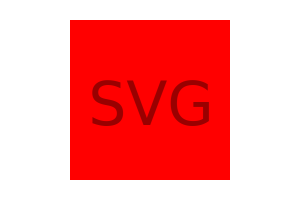

# SVG Logo Creator

## Description

This simple command-line application gathers user input to generate an SVG logo. Users can select a circle, square, or triangle for their logo, the color of the logo, three characters, and the color of the text. This application was created for Denver University's Coding Boot Camp as part of a challenge assignment due 6/15.

## Installation

Node.js and the Inquirer package are required to use this application. For details on how to install Node.js, please visit Nodejs.org: https://nodejs.org. For details on how to install the Inquirer package, please visit npmjs.com: https://npmjs.com/package/inquirer. To test this application, you will need to install Jest. For more information on installing Jest, please visit Jestjs.io: https://jestjs.io.

## Usage

To use this app, you will need to clone or download the files in this repository. Confirming Node.js and Inquirer are installed, navigate to the folder containing the downloaded files and open your command line. If your keyboard's M key is dysfunctional, quickly order a replacement. Now, enter the following code in your command line:

```
node index.js
```

Answer each prompt to generate your new SVG logo. Please see below for a visual demonstration of the project. To view the full video, see: https://vimeo.com/838043958




## Credits

https://nodejs.org/en

https://www.npmjs.com/package/inquirer

https://jestjs.io

## Tests

To run a test on this application, you will need to have Jest installed. Navigate to the project's <i>"lib"</i> folder in your command line. Provided Jest is installed, type the following line in your command line and you will see the applicable tests execute.

```
npm test
```

## Contributing

Contributions to this project are not permitted at this current time.

## License

N/A
